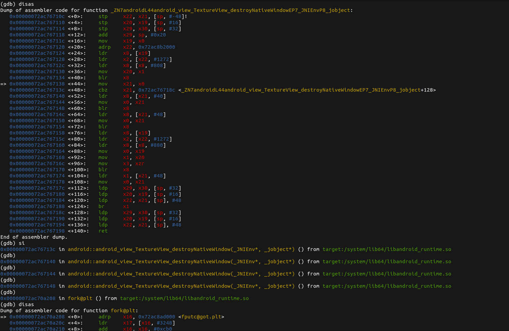
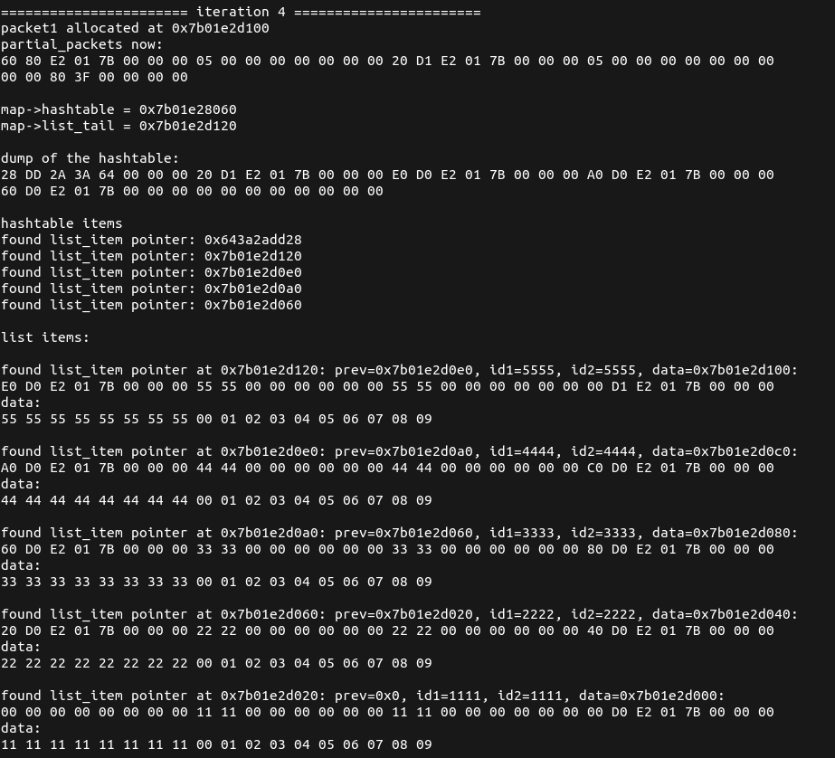
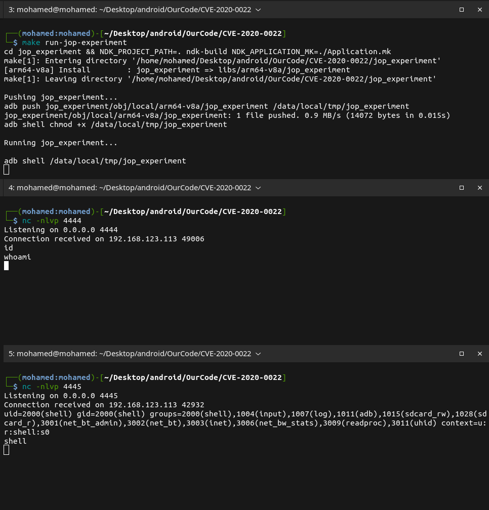

# CVE-2020-0022
Many thanks to Insinuator for their [amazing blog post and code](https://insinuator.net/2020/04/cve-2020-0022-an-android-8-0-9-0-bluetooth-zero-click-rce-bluefrag/)!

## Results
All the steps mentioned in the insinuator post have been completed, and more. These are a lot of steps to put in a `README.md` file, so feel free to check out [the post from Insinuator](https://insinuator.net/2020/04/cve-2020-0022-an-android-8-0-9-0-bluetooth-zero-click-rce-bluefrag/) mentioned above.

The exploit is fully complete up to the point where:
 1. The address attacker-controlled sufficiently big memory area is leaked
 2. The program counter is modified to point to a custom address
 3. Retries are made automatically to the point where the chances of failure decrease significantly
 4. The code is optimized in terms of disconnection time and memory search speed to the point where more optimization compromises the stability of the exploit

### Differences and Improvements
This exploit differs from Insinuator's implementation in the following ways:
 1. It is written in C rather than python (because I love C)
 2. It is written in a modular way, where each module is responsible for a specific task
 3. It was tested on a Pixel 3 XL running Android 9 (PQ3A.190801.002, Security Patch Level 2019-08-01) because this is what I had lying around
 4. It leaks addresses in `libandroid_runtime.so` rather than `libicuuc.so`, because that worked better on this phone/target
 5. It has two example JOP chains implemented, one that calls `execv` directly and one that calls `fork` then `execv`
 6. It is accompanied with [custom Ghidra script](ghidra_scripts/ProcessLibandroidRuntime.java) that processes the `libandroid_runtime.so` file and extracts the offsets of functions and gadgets (to ease porting the exploit to other targets)

### Demo/Screenshots
This is a video demo showing the exploit modifying the PC to point to a custom address:
[](https://www.youtube.com/watch?v=JvACEXSmJEQ)

The first iteration of the chain is the one that can be seen in the [jop_experiment](jop_experiment). This chain calls `execv` directly without calling fork. It can be found [in commit ca28fdf](https://github.com/themmokhtar/CVE-2020-0022/blob/ca28fdf63ba1533685d64f57317e67dbd23c3fd7/notes/JOP_PLAN.md) This is what occurs when using this chain:


The second iteration of the chain is the one that calls `fork` then `execv`. Full details of this chain can be found [here](notes/JOP_PLAN.md). This is what occurs when using this chain:


Thankfully, Pixel 3 XL has protections that prevent the bluetooth process from calling `fork` and/or `execv`. In terms of knowledge-sharing or showing-off, my work here is done. If I write and share anything more advanced, it may be too helpful for black-hats. 

### Conclusion of the Exploit
I consider this exploit to be complete. Future improvements may be:
 - Writing a JOP chain to call `dlsym` then `mprotect` to run custom shellcode
 - Collecting and saving a database of offsets for different targets
 - Testing the exploits on multiple targets to aim for relative universality
 - Chaining the exploit with an OS-level exploit to gain root privileges (like [my previous CVE-2019-2215 exploit](https://github.com/themmokhtar/CVE-2019-2215))
 - And more...

All of these things turn this project from a fun knowledge-sharing project to a black-hat exploit that can be weaponized, so this is where my journey ends, for now.... If you have any questions, [feel free to get in touch](https://www.linkedin.com/in/themmokhtar/).

## Usage
To run the exploit, just run:
```
make build run ARGS="00:00:00:00:00:00" 
```
Where `00:00:00:00:00:00` is the MAC address of the target/victim device. Other than `make clean`, the rest of the build targets are only helpful if you're trying to modify, improve, or reimplement the exploit, so there's no need to mention them in depth.

## Debugging
 - The android `gdbserver` binary can be found in the NDK folder
 - Use this to debug the target (not recommended):
```
# On target
/data/local/tmp/gdbserver 0.0.0.0:1234 --attach $(ps -A | grep -i "com.android.bluetooth" | awk '{print $2}')

# On host
adb forward tcp:1234 tcp:1234
gdb-multiarch -q -x ./gdbinit
```
 - Directly on the phone through termux's gdb (recommended):
```
# On host
adb push ./gdbinit /data/local/tmp/gdbinit

# On target
su
/data/data/com.termux/files/usr/bin/gdb -q -x /data/local/tmp/gdbinit -p $(ps -A | grep -i "com.android.bluetooth" | awk '{print $2}') 
# OR
/data/data/com.termux/files/usr/bin/gdb -q -p $(ps -A | grep -i "com.android.bluetooth" | awk '{print $2}') 
```

You can restart the bluetooth service on the attacker machine in case it stops working:
```
sudo systemctl restart bluetooth.service
```

## Notes 
This section explains some of the phenomena that were observed during the development of this exploit:

 - SSP is turned off (when creating an HCI socket fd) in order to prevent a timeout on the remote target:


 - We are spraying heap cleaner packets in order to reduce the chance of the target crashing due to a an unintended overflow in that modifies the vtables of the `base::MessageLoop` object used through `get_message_loop`:


 - ~~This was not well explained in the insinuator post. We are leaking the address of a packet by trying to target a the 32-byte malloc chunks, which include one linked-list item for each item in the `partial_packets` `unordered_map`. This was figured out using the [map_experiment](map_experiment/)~~ The map_experiment does not match what is leaked in the actual program, so I just followed insinuator's pattern and used another pattern (which I also found by experimentation).
<details>
<summary>The result of the map_experiment</summary>


</details>

 - The crash and PC overwrite and crashes the chrome signal object successfully


 - The JOP chain has been simulated using the [jop_experiment](jop_experiment/). The full (first, execv-only) JOP chain is explained in the [JOP_PLAN.md](notes/JOP_PLAN.md)


