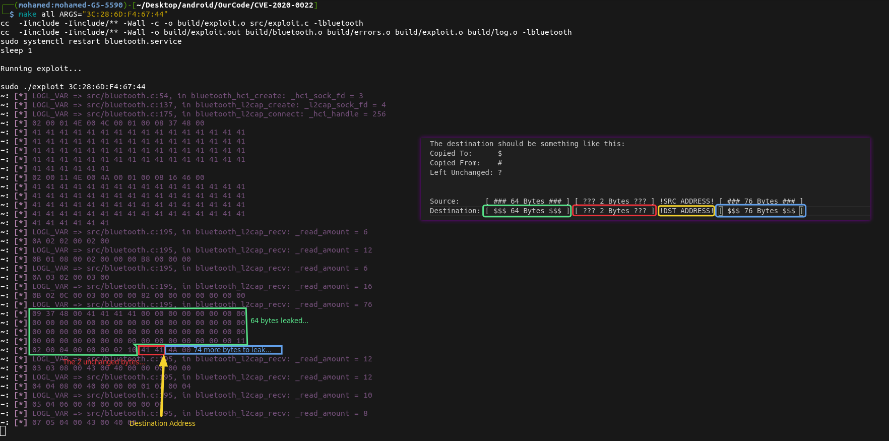

# CVE-2020-0022
Many thanks to Insinuator for their [amazing blog post and code](https://insinuator.net/2020/04/cve-2020-0022-an-android-8-0-9-0-bluetooth-zero-click-rce-bluefrag/)!


## Debugging
 - The android `gdbserver` binary can be found in the NDK folder
 - Use this to debug the target:
```
# On target
/data/local/tmp/gdbserver 0.0.0.0:1234 --attach $(ps -A | grep -i "com.android.bluetooth" | awk '{print $2}')

# On host
adb forward tcp:1234 tcp:1234
gdb-multiarch -q -x ./gdbinit
```
 - Directly on the phone through termux's gdb:
```
# On host
adb push ./gdbinit /data/local/tmp/gdbinit

# On target
su
/data/data/com.termux/files/usr/bin/gdb -q -x /data/local/tmp/gdbinit -p $(ps -A | grep -i "com.android.bluetooth" | awk '{print $2}') 
```

You can restart the bluetooth service in case it stops working:
```
sudo systemctl restart bluetooth.service
```

## Results
This is the simple leak result:


Debugging the simple leak using the gdbinit script:


## Notes
 - SSP is turned off (when creating an HCI socket fd) in order to prevent a timeout on the remote target:


 - We are spraying heap cleaner packets in order to reduce the chance of the target crashing due to a an unintended overflow in that modifies the vtables of the `base::MessageLoop` object used through `get_message_loop`:


 - This was not well explained in the insinuator post. We are leaking the address of a packet by trying to target a the 32-byte malloc chunks, which include one linked-list item for each item in the `partial_packets` `unordered_map`. This was figured out using the [map_experiment](map_experiment/):


<<<<<<< Updated upstream
# TODOs
=======
 - The JOP chain has been simulated using the [jop_experiment](jop_experiment/). The full JOP chain is explained in the [JOP_PLAN.md](notes/JOP_PLAN.md)


# Future Improvements
>>>>>>> Stashed changes
 - Make sure that you can use libandroid_runtime.so for JOP (make sure you have good gadgets and a good dispatcher)
 - Find some pointer to overwrite in the heap to jump to the payload
 - Write a JOP chain that calls mmap and memcpy
 - Increase the chances of leaking the payload
 - Increase the chances of leaking the libandroid_runtime.so base address
